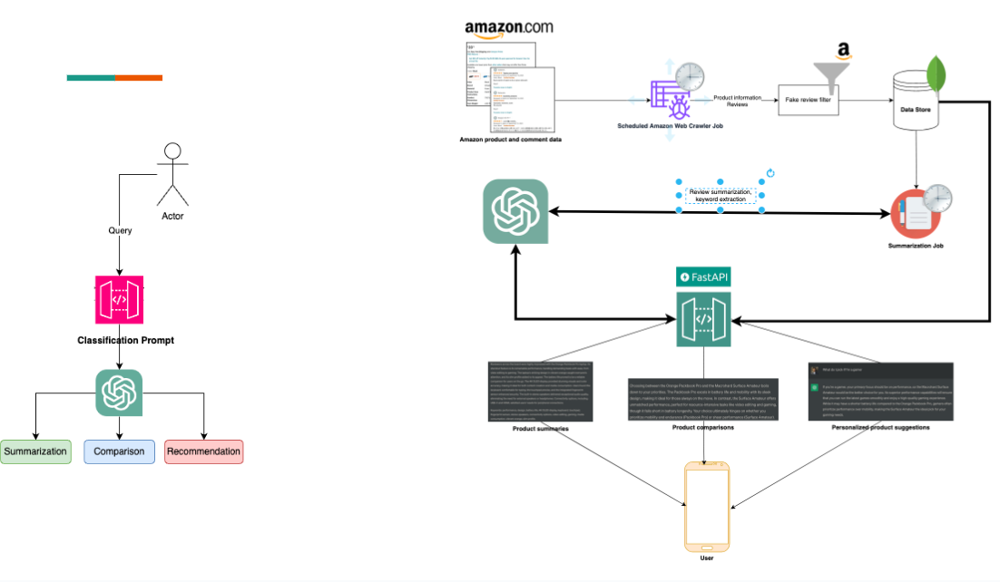

 <h1 align="center"> 🛍️ ShopGPT 🛍️ </h1>
 <h3 align="center"> An AI-revamped shopping experience </h3>
 
 A LLM-assisted Amazon shopping assistant that simplifies reviewing online feedback, helping to analyze product summaries and gain better insight to advise on Amazon purchases. 

## 🌐 Motivation

Reviews play a central role in the path to purchase, and many consumers don’t just skim them before purchasing or passing on a product. 53% of users within the age group 18-34 read Amazon review for more than 10 minutes before deciding to buy a product. It is also useful to compare products in terms of user reviews side-by-side to appreciate their strengths, weaknesses and other related issues, as well as, interpret reviews based on personalized requirements.

## 📕 System Architecture

A high-level design for the proposed system is presented below:

### Key Components:

Our key components all use the OpenAI API, with **GPT3.5-turbo** as a base model for AI-driven predictions.

* **Prompt Classifier** : Classifies whether the user wants a summary, comparison or recommendation. Internal backend component.
* **Review Summarizer** : Summarizes multiple reviews in JSON format and returns structured product review summaries. An example is shown below:
  
  
  
* **Product Comparisons**: Performs structured comparison across pairs of products. An example is shown below:
  
  
  
* **Personalized Product Recommendations**: Given a user input, generates product recommendations by comparison of summaries guided by the user's requirements. An example is shown below:
  
  

* **Keyword Extraction**: Extract keywords from the summarized reviews and allow to filter the summary according to a keyword. An example is shown below:

  

## 🚀 Technology Stack:
  
 - **Frontend**:  
 - **GPT 3.5 API**: 
 - **Database**: 

 ## 🗄️ Dataset Used and Data Storage

We use the [Amazon Review Dataset](https://cseweb.ucsd.edu/~jmcauley/datasets/amazon_v2/) Provided by UCSD (2018) with 233.1 million reviews. The dataset contains reviews in the range May 1996 - Oct 2018. We host a subset of this dataset in JSON format, along with associated metadata on MongoDB Atlas. 

## ✍️ Instructions to Run

- **Clone the repository**: `git clone https://github.com/VijayrajS/ShopGPT`
- **Create a Python virtual environment:** Follow instructions from [virtualenv Documentation](https://docs.python.org/3/library/venv.html)
- **Install necessary Python packages**: `pip install -r requirements.txt`
- **Set up your own OpenAI API key**: Follow instructions from [OpenAI API docs](https://platform.openai.com/docs/quickstart?context=python)
- **Download the dataset** from [UCSD Amazon Reviews Dataset](https://cseweb.ucsd.edu/~jmcauley/datasets/amazon_v2/)
- **Host your Database**: Host the downloaded dataset on MongoDB Atlas.
- **Run the App Locally**: Run `python UI_v0.py`

## Demo (YouTube)
 
